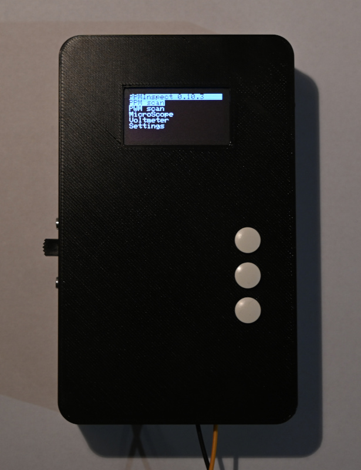
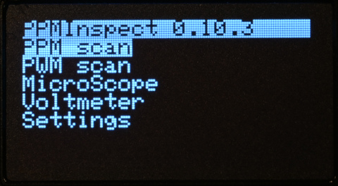
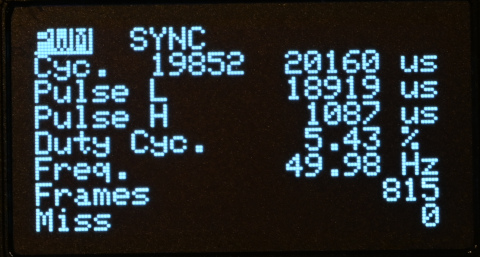
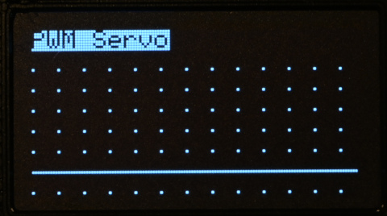
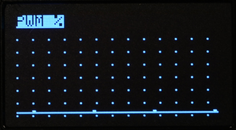
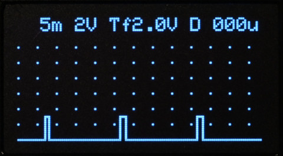

# PPMInspect

Diese Anleitung beschreibt PPMInspect 0.10.3 (Januar 2024)

---
## Grundsätzliche Bedienung

Die Bedienung erfolgt über 3 Taster.
Die Taster unterscheiden einen kurzen und einen langen (> 250 MilliSekunden) Tastendruck. \
Wird der Taster länger als 1 Sekunde gedrückt gehalten wird die Funktion eines kurzen Tastendrucks automatisch wiederholt.

Taster 1:
- kurz:   UP
- lang:   RESET

Taster2:
- kurz:   ENTER
- lang:   CLEAR

Taster3:
- kurz:   DOWN
- lang:   OPTION

Seit Version 0.9.15 wird die Versorgungsspannung überwacht.\
Fällt die Spannung unter den in den Einstellungen eingestellten Wert, so wird im Display periodisch "Low Bat" angezeigt.

---
## Funktionstasten übersicht

### PPM Scan

- UP: Vorherige Zeile
- RESET: Sampling neu starten

- ENTER: Zur Kanalanzeige
- CLEAR: Zum Hauptmenü

- DOWN: Nächste Zeile
- OPTION: - 

### PPM Scan Kanalanzeige

- UP: Vorherige Zeile
- RESET: -

- ENTER: Zum PPM Scan
- CLEAR: Zum PPM Scan

- DOWN: Nächste Zeile
- OPTION: -

### PWM Scan

- UP: Vorherige Zeile
- RESET: Sampling neu starten

- ENTER: Zur grafischen PWM Anzeige
- CLEAR: Zum Hauptmenü

- DOWN: Nächste Zeile
- OPTION: -

### Grafische PWM Anzeige

- UP: Zum PWM Scan
- RESET: Wechsel "Servo" / "%" Modus

- ENTER: -
- CLEAR: Zum PWM Scan

- DOWN: Anzeige einfrieren
- OPTION: Gitter aus/ein

### MicroScope

- UP: Zum Hauptmenü
- RESET: -

- ENTER: MicroScope Einstellungen
- CLEAR: Zum Hauptmenü

- DOWN: Anzeige einfrieren
- OPTION:  Gitter aus/ein

### Voltmeter

- UP: Zum Hauptmenü
- RESET: Minimum/Maximum zurücksetzen

- ENTER: Zum Hauptmenü
- CLEAR: Zum Hauptmenü

- DOWN: Minimum/Maximum Ein/Aus
- OPTION: -

### Settings

- UP: Vorherige Zeile
- RESET: -

- ENTER: Einstellung ändern
- CLEAR: -

- DOWN: Nächste Zeile
- OPTION: -

---
## Funktionen

Im Hauptmenü wird die Funktion mit UP / DOWN ausgewählt und mit ENTER aufgerufen.

---
## PPM Scan

Der PPM Scanner synchronisiert sich auf ein PPM Signal und zeigt die Signal Parameter an.

- Frame: Die Frame Länge in Microsekunden. Minimum und Maximum.
- Pulse: Die Pulslänge die jeden Kanal einleitet. Jeweils Minimum und Maximum, sowie die Puls Polarität.
- Level: Den Spannungslevel für LOW und HIGH in Volt.
- Frames: Die Anzahl der dekodierten Frames.

Mit CLEAR (langer Druck auf die ENTER Taste) wird in das Hauptmenu zurück gesprungen.

Mit RESET (langer Druck auf die UP Taste) werden alle Werte zurück gesetzt und neu synchronisiert.\
Mit der DOWN Taste kann nach unten gescrollt und weitere Parameter angezeigt werden.

- E: Long frames: Zu lange (verlorene) Frames
- E: Ch. count: Falsche Anzahl an Kanälen
- E: Pulse time: Puls Timing ausserhalb der Spezifikation (Siehe Einstellungen)

Ein kurzer Druck auf ENTER wechselt zur Kanal Anzeige.\
Hier wird für jeden Kanal der letzte, der minimale und der maximale Timing Wert in Microsekunden angezeigt.\
Ein weiterer Druck auf ENTER wechselt zurück in die Scan Anzeige.

---
## PWM Scan

Der PWM Scanner zeigt die Eigenschaften einen PWM Signals an.

- Cyc.: Zykluszeit (H Puls + L Puls) in Microsekunden. Minimum und Maximum. 
- Pulse L: Zeit des letzten L Pulses.
- Pulse H: Zeit des letzten H Pulses.
- Duty Cyc.: Duty cycle. Prozentsatz des H Pulses an der Gesamtzeit.
- Freq.: Aktuelle PWM Frequenz
- Frames: Anzahl gescannter Frames
- Miss: Timer Überlauf. Kein Puls für 32 Millisekunden.

Mit CLEAR (langer Druck auf die ENTER Taste) wird in das Hauptmenu zurück gesprungen.

Mit RESET (langer Druck auf die UP Taste) werden alle Werte zurück gesetzt und neu synchronisiert.

ENTER schaltet zu grafischen Anzeige um.

"PWM Servo" zeigt den Zeitwert des HIGH Pulses an. Der Wertebereich ist 900 - 2100 Microsekunden.

"PWM %" zeigt den Prozentsatz des H Pulses an der Gesamtzeit an.

---
## MicroScope

Ein einfaches Oszillosop. (ACHTUNG: Nur positive Spannungen)

Mit ENTER wechselt man in die Oszilloskop Einstellungen.\
Folgende Werte können durch Drücken der UP / DOWN Tasten verstellt werden.  

- Samplingrate: Einstellbar zwischen 10 und 1000 Microsekunden (Entspricht 1 KHz bis 100 kHz)
- Oversampling: Siehe Oversampling
- Y Auflösung: 2V pro Einheit oder 1V pro Einheit.
- Triggermode: Einstellbar auf "f" freilaufend, "+" ansteigende Flanke, "-" abfallende Flanke
- Triggerlevel: in Volt
- Triggerverzögerung: Einstellbar zwischen 0 und 9900 Microsekunden. \
  Ein Trigger wird nur ausgelöst, wenn über diesen Zeitraum vorher kein weiterer Trigger gefunden wurde. \
  Damit wird der lange Sync Impuls ausgeblended und es wird immer auf den ersten Kanal getriggert. \
  Ein guter Wert für ein PPM Signal sind 2500 Microsekunden.

Mit UP oder CLEAR (langer Druck auf die ENTER Taste) wechselt man zurück in das Hauptmenü.

Mit jedem neuen Datensatz wird der "Update" Marker ein/aus geschaltet.  
Das passiert im freilaufenden Modus und immer wenn ein Trigger anspricht.

Oversampling mittelt den Wert eines Samples aus mehreren Messungen.\
Oversampling ist nicht immer erwünscht und muss daher explizit eingeschaltet werden.\
Es wird angezeigt durch ein "O" hinter der Samplingrate.

Oversampling is von der eingestellten Samplingrate abhängig.

- 10 und 20 Microsekunden: kein Oversampling
- 50 Microsekunden: 2 fach Oversampling
- 100 Microsekunden: 4 fach Oversampling
- \>= 200 Microsekunden: 8 fach Oversampling

Ein kurzer Druck auf die DOWN Taste friert die Anzeige ein. 

Ein langer Druck auf die DOWN Taste (OPTION) schaltet das Gitter ein und aus.\
Abstand der vertikalen Gitterlinien: 10 Samples.

---
## Voltmeter

Ein einfaches Voltmeter. (ACHTUNG: Nur positive Spannungen)

Seit Version 0.9.14 werden die gemessenen minimum und maximum Wert zusätzlich angezeigt.\
Ausserdem wurde die Samplefrequenz erhöht.

Ein Druck auf die DOWN Taste schaltet min/max aus und setzt die Samplefrequenz auf 2 Werte pro Sekunde herunter.
Ein langer Druck auf die UP Taste setzt die min/max Werte zurück.

---
## Einstellungen

- Pulse min/max: Limits für das Puls Signal. Pulse ausserhalb der Limits werden als Fehler angezeigt.
- Servo min/max: Limits für Kanäle (Servos). 
- Sync min: Minimum Synchronisations Puls.

- Vppm +/-: Kalibrierung der gemessenen Signalspannung.
- Vcc +/-: Kalibrierung der gemessenen Versorgungsspannung.
- Low Bat: Warnschwelle für die Versorgungsspannung.
- Memfree: Freier RAM Speicher in bytes. (Bei Programstart / minimum)

